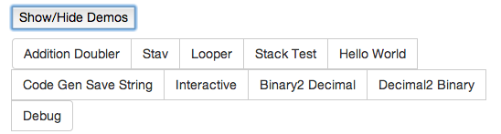
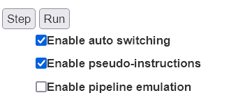
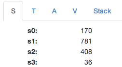
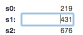
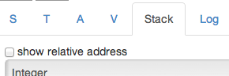
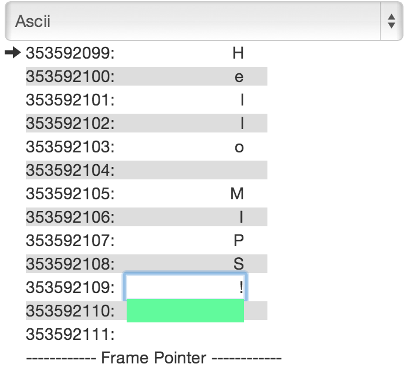

<body class="c25">
Eric Wooley, Ortal Yahdav

WeMIPS Documentation (MIPS Emulator)

<a class="c7" href="#h.rsu9q4vkwm40">Installation Guide</a>

<a class="c7" href="#h.ye4dhod52eub">Available MIPS Instructions</a>

<a class="c7" href="#h.muilw39vqa42">Available MIPS Syscalls</a>

<a class="c7" href="#h.mjw4rmie1hrl">User&#39;s Guide</a>

<a class="c7" href="#h.nkpo0qdlt6pk">Running A Program</a>

<a class="c7" href="#h.pepcyf380cso">Features</a>

<a class="c7" href="#h.tehglim0uo52">Go to line number</a>

<a class="c7" href="#h.pgz50cglii7">Demos</a>

<a class="c7" href="#h.yw97n2lkwbjo">Auto switch register/stack/log tabs</a>

<a class="c7" href="#h.q5hqvyasmyap">Show stack byte as number/ascii/binary</a>

<a class="c7" href="#h.vhp6uhppx4mw">View registers</a>

<a class="c7" href="#h.g6wc8q5eu06m">Modify register value</a>

<a class="c7" href="#h.9v5m8l9m4seh">Other Notes</a>

<a class="c7" href="#h.6uqxvrqa4n42">Stack</a>

<h1 class="c1">Installation Guide</h1><ol class="c9 lst-kix_5l16laijtj3y-0 start" start="1"><li><a href="http://wemips.herokuapp.com" target="_blank">View Online</a> or continue to step 2</li><li class="c4 c20 c1">Clone WeMips somewhere on your computer.</li><li class="c4 c20 c1">Drag and drop the top-most Wemips.html&nbsp;file onto Google Chrome.</li><li class="c4 c20 c1">You can now use WeMIPS!</li></ol><h1 class="c1">Available MIPS Instructions</h1>
Mips Arithmetic Instructions
<ul class="c9 lst-kix_fx3vk7hj0nsy-0 start"><li class="c4 c20 c1">ADD, ADDI, ADDU, ADDIU, SUB, SUBU, LUI.</li></ul>

Mips Logical Instructions
<ul class="c9 lst-kix_r5nf5veonwz6-0 start"><li class="c4 c20 c1">AND, ANDI, NOR, OR, ORI, SLL, SRL.</li></ul>

Mips Branch and Jump Instructions
<ul class="c9 lst-kix_1wmw3o7kw8o4-0 start"><li class="c4 c20 c1">BEQ, BNE, J, JAL, JR.</li></ul>

Mips Memory Access Instructions
<ul class="c9 lst-kix_qs234h2t1tqy-0 start"><li class="c4 c1 c20">LW, SW, LH, LHU, SH, LB, LBU, SB.</li></ul>

Mips Comparison Instructions
<ul class="c9 lst-kix_9td3mcttkhhs-0 start"><li class="c4 c20 c1">SLT, SLTI, SLTU, SLTIU.</li></ul>

Note:&nbsp;Instructions marked in red are experimental. These instructions should work, but haven&#39;t been thoroughly tested,
<h1 class="c1">Available MIPS Syscalls</h1>
The syscalls supported are similar to the ones which the MARS emulator uses: <a class="c7" href="http://courses.missouristate.edu/kenvollmar/mars/help/syscallhelp.html">http://courses.missouristate.edu/kenvollmar/mars/help/syscallhelp.html</a>

<table cellpadding="0" cellspacing="0" class="c24"><tbody><tr><td class="c6">
Description
</td><td class="c10">
$v0 code
</td><td class="c12">
Arguments
</td><td class="c11">
Return Value
</td></tr><tr class="c0"><td class="c6">
Print Integer
</td><td class="c10">
1
</td><td class="c12">
$a0 = integer to print
</td><td class="c11">

</td></tr><tr><td class="c6">
Print String
</td><td class="c10">
4
</td><td class="c12">
$a0 = stack address of null-terminated string to print to console
</td><td class="c11">

</td></tr><tr class="c0"><td class="c6">
Read Integer
</td><td class="c10">
5
</td><td class="c12">

</td><td class="c11">
$v0 = contains integer read
</td></tr><tr class="c0"><td class="c6">
Read String
</td><td class="c10">
8
</td><td class="c12">
$a0 = address of input buffer

$a1 = maximum number of characters to read (this will be one less than the allowed string since it needs space for the null terminator)
</td><td class="c11">
$v0 = contains the length of the input string
</td></tr><tr class="c0"><td class="c6">
Confirm Dialog
</td><td class="c10">
50
</td><td class="c12">
$a0 = address of null-terminated string that is the message to user
</td><td class="c11">
$a0 contains value of user-chosen option

0: OK

1: Cancel
</td></tr><tr class="c0"><td class="c6">
Input Dialog Int
</td><td class="c10">
51
</td><td class="c12">
$a0 = address of null-terminated string that is the message to user

</td><td class="c11">
$a0 contains int read

$a1 contains status value

0: OK status

-1: input data cannot be correctly parsed

-2: Cancel was chosen

-3: OK was chosen but no data had been input into field
</td></tr><tr class="c0"><td class="c6">
Input Dialog String
</td><td class="c10">
54
</td><td class="c12">
$a0 = address of null-terminated string that is the message to user

$a1 = address of input buffer

$a2 = maximum number of characters to read
</td><td class="c11">
$a1 contains status value

0: OK status. Buffer contains the input string.

-2: Cancel was chosen. No change to buffer. 

-3: OK was chosen but no data had been input into field. No change to buffer.

-4: length of the input string exceeded the specified maximum. Buffer contains the maximum allowable input string plus a terminating null.
</td></tr><tr class="c0"><td class="c6">
Alert
</td><td class="c10">
55
</td><td class="c12">
$a0 = address of null-terminated string that is the message to user
</td><td class="c11">

</td></tr><tr class="c0"><td class="c6">
Alert Int
</td><td class="c10">
56
</td><td class="c12">
$a0 = address of null-terminated string that is an information-type message to user

$a1 = int value to display in string form after the first string
</td><td class="c11">

</td></tr><tr class="c0"><td class="c6">
Alert String
</td><td class="c10">
59
</td><td class="c12">
$a0 = address of null-terminated string that is an information-type message to user

$a1 = address of null-terminated string to display after the first string
</td><td class="c11">

</td></tr><tr class="c0"><td class="c6">
Generate Save String Code
</td><td class="c10">
60
</td><td class="c12">
$a0 = stack address of null-terminated string to generate code for
</td><td class="c11">

</td></tr><tr class="c0"><td class="c6">
Binary -&gt; Decimal
</td><td class="c10">
61
</td><td class="c12">
$a0 = stack address of binary string
</td><td class="c11">

</td></tr><tr class="c0"><td class="c6">
Decimal -&gt; Binary
</td><td class="c10">
62
</td><td class="c12">
$a0 = decimal number to convert

$a1 = number of chars to output

$a2 = size of each block to output
</td><td class="c11">

</td></tr></tbody></table>

<h1 class="c1">User&#39;s Guide</h1><h2 class="c1">Running A Program</h2>
There are 2 ways to process your code: Stepping, and Running.

<ul class="c9 lst-kix_wh8q5r6nlnkm-0 start"><li class="c4 c20 c1">The first way is to &ldquo;step&rdquo; through 1 line at a time. This can be accomplished by clicking the step button. When you step through your code, you will see that the editor will highlight specific lines. These lines indicate which lines the emulator is processing. The last line the emulator successfully ran will be highlighted in green. The next line to be run will be highlighted in grey. If the emulator runs into a MIPS error, it will be highlighted in red. You will notice as you step through your program that the last register, or stack address changed, is also highlighted in green. See the Auto Switch feature for more details.</li><li class="c4 c20 c1">The second way to process your code is to &ldquo;run&rdquo; it. This can be accomplished by clicking the run button. When you run your code, each line is successively run until your program is interrupted. Your program can be interrupted by errors, requests for input, or the completion of your code.</li></ul>

<h2 class="c1">Features</h2><h3 class="c1">Go to line number</h3>

You can type a line number and press Go to jump to a specific line of code. This will become the next line the mips engine will run.

<h3 class="c1">Demos</h3>

Tap the Show/Hide Demos button to reveal the list of built-in demos. Tap a demo (e.g. Hello World) to replace the existing MIPS code with the predefined MIPS code for that demo. Then press run (or step) to watch it execute. Most of them are self explanatory, or have comments that explain how they work.
<h3 class="c1">Auto switch register/stack/log tabs</h3>

With this feature enabled, whenever a register (or stack) is modified, the tab will automatically switch the corresponding tab so that you can see the relevant change. In the case where multiple things are modified at once, the last change will take precedence.
<h3 class="c1">Show stack byte as number/ascii/binary</h3>
Sometimes it is useful to see the actual bits that compose a byte, or to see the corresponding ASCII character that is stored in the stack. You can toggle between seeing any of these three values for a corresponding address in the stack.
<h3 class="c1">View registers</h3>

Up top we can toggle which registers are currently visible (S, T, A, or V registers). Underneath that, we can see a register&#39;s current value. Registers are initially populated with junk data until an instruction modifies them. In this screenshot, we can see that the $s0 register currently has the value 170. A register is composed of 32 bits, and can therefore hold 232&nbsp;different values.

<h3 class="c1">Modify register value</h3>

You can click a register&#39;s value and overwrite its contents with whatever you want.
<h1 class="c1">Other Notes</h1><h2 class="c1">Stack</h2>
The stack is byte-addressable, and is currently the only place to store anything of great length. Each time you start the emulator, the frame pointer will be initialized to a random address less than 2^32, in order to simulate the fact that when you first run your program, the frame pointer may be at any given value.

The black arrow is used to show where $sp is currently pointing to.

You can click show relative address, in order to show relative addresses from the frame pointer rather than having to look at large numbers.

You can change a value in the stack by clicking it to edit it. You can also view it in several modes, as an integer, in binary, and it&rsquo;s ascii representation (&lsquo;None&rsquo; if no ascii character is available). Viewing the stack in a different mode doesn&rsquo;t mean you can&rsquo;t edit it. You can edit it in binary mode to save a binary representation, as you could with integers and ascii.
</body></html>