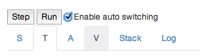

# WeMIPS Documentation (MIPS Emulator)

WeMIPS is an instruction-level emulator for the assembly language of the MIPS32 architecture. It is implemented in client-side JavaScript and HTML, and can thus be run in your own (JavaScript-capable and -enabled) webbrowser.

While WeMIPS can be provided on-line (for example [here](https://wemips.ralfgerlich.biz)), it is also possible to simply install it locally on your own computer and use it there.

The WeMIPS Emulator was originally created by Eric Wooley and Ortal Yahdav, with additions and updates by Ralf Gerlich.

## Installation Guide

1. [View Online](https://wemips.ralfgerlich.biz) for the version hosted by Ralf Gerlich, or [wemips.dev.plumbing for the version hosted on github pages](https://wemips.dev.plumbing/WeMips.html) or clone [WeMIPS](https://github.com/ericwooley/WeMips) somewhere on your computer.
2. Open the top-most *WeMips.html* in your browser.
3. You can now use WeMIPS!

## User's Guide

### Running a Program

There are 2 ways to process your code: Stepping, and Running.

* The first way is to "step" through 1 line at a time.
  This can be accomplished by clicking the step button.
  When you step through your code, you will see that the editor will highlight specific lines.
  These lines indicate which lines the emulator is processing.
  The last line the emulator successfully ran will be highlighted in green.
  The next line to be run will be highlighted in grey.
  If the emulator runs into a MIPS error, it will be highlighted in red.
  You will notice as you step through your program that the last register, or stack address changed, is also highlighted in green.
  See the Auto Switch feature for more details.
* The second way to process your code is to "run" it.
  This can be accomplished by clicking the run button.
  When you run your code, each line is successively run until your program is interrupted.
  Your program can be interrupted by errors, requests for input, or the completion of your code.

### Features

#### Constant Expressions

Wherever an immediate value is required, you can use expressions with operands such as addition, subtraction, etc., as long as the result is a constant value.

For example, it is possible to use

```asm
addi $t0, $zero, (15+3*32)
```

Operators are evaluated according to their precedence, i.e., addition and subtraction have lower precedence than multiplication and the former are thus evaluated after the latter.
In the following, operands are listed in decreasing order of precedence (i.e., operators further down in the list are evaluated after operators further up):

- Unary Plus ("+"), Unary Minus ("-"), Bitwise NOT ("~"), Logical NOT ("!")
- Multiplication ("\*"), Division ("/"), Remainder ("%")
- Addition ("+"), Subtraction ("-")
- Shift Left ("<<"), Arithmetic Shift Right (">>"), Logical Shift Right (">>>")
- Less Than ("<"), Less Than or Equal ("<="), Greater Than or Equal (">="), Greater Than (">")
- Equals ("=="), Not Equals ("!=")
- Bitwise AND ("&")
- Bitwise XOR ("^")
- Bitwise OR ("|")
- Logical AND ("&&")
- Logical OR ("||")
- Ternary Conditional Operator ("cond?trueValue:falseValue")

It is also possible to extract the lower and higher 16 bits of a constants, respectively, by using the `lo16` and `hi16` functions:

```asm
lui $t0, hi16(123456)
addiu $t0, $t0, lo16(123456)
```

Numerical constants can be provided in decimal, hexadecimal, octal and binary:

- Hexadecimal numbers are specified with a `0x` or `0X` prefix, e.g., `0xabcd`. Case does not matter, i.e. `0XABcd` is the same as `0xabCD`.
- Octal numbers are prefixed by a `0`, e.g. `0775`.
- Binary numbers are specified with a `0b` or `0B` prefix, e.g. `0b101001010`.
- Decimal numbers are specified without any prefix. That also means that they may *not* start with a zero (`0`), otherwise they will be interepreted as octal (which will lead to errors if using non-octal digits).

#### Named Constants

It is possible to introduce named constants for use in expressions.
Simply add a line of the form `symbol = expression`.
You will be able to use the name `symbol` in other expressions after that assignment.

```asm
x = 312
y = x*x

lui $t0, hi16(y)
addiu $t0, $t0, lo16(y)
```

#### Go to Line Number


You can type a line number and press Go to jump to a specific line of code.
This will become the next line the mips engine will run.

#### Demos


Tap the Show/Hide Demos button to reveal the list of built-in demos.
Tap a demo (e.g. Hello World) to replace the existing MIPS code with the predefined MIPS code for that demo.
Then press run (or step) to watch it execute.
Most of them are self explanatory, or have comments that explain how they work.

#### Auto switch register/stack/log tabs



With this feature enabled, whenever a register (or stack) is modified, the tab will automatically switch the corresponding tab so that you can see the relevant change.
In the case where multiple things are modified at once, the last change will take precedence.

#### Enable/Disable Pseudo-Instruction Support

By default, the supported pseudo-instructions are active.
To disable them, remove the checkmark.
The emulator will then report an error when you use a pseudo-instruction.

#### Pipeline Emulation

By default, emulation of pipeline effects - such as delayed branch execution - is disabled.
To enable it, activate the checkmark.
Note that now branch and jump instructions will be delayed by one instruction, so that the instructions immediately after the branch/jump will be executed before the command that is being jumped to.

#### Show stack byte as number/ascii/binary

Sometimes it is useful to see the actual bits that compose a byte, or to see the corresponding ASCII character that is stored in the stack.
You can toggle between seeing any of these three values for a corresponding address in the stack.

#### View registers


Up top we can toggle which registers are currently visible (S, T, A, or V registers).
Underneath that, we can see a register's current value.
Registers are initially populated with junk data until an instruction modifies them.
In this screenshot, we can see that the $s0 register currently has the value 170.
A register is composed of 32 bits, and can therefore hold 2<sup>32</sup> different values.

#### Modify Register Value


You can click a register's value and overwrite its contents with whatever you want.

## Available MIPS instructions

| Category                         | Instructions                           |
| -------------------------------- | -------------------------------------- |
| Arithmetic Operations            | ADD, ADDI, ADDU, ADDIU, SUB, SUBU, LUI |
| Comparison Instructions          | SLT, SLTI, SLTU, SLTIU                 |
| Logical Operations               | AND, ANDI, OR, ORI, XOR, XORI, NOR     |
| Shift Operations                 | SLL, SLLV, SRL, SRLV, SRA, SRAV        |
| Jump Instructions                | B, J, JAL, JR, JALR                    |
| Branch Instructions              | BEQ, BNE, BGE, BGT, BLE, BLT           |
| Branch Instructions (unsigned)   | BGEU, BGTU, BLEU, BLTU                 |
| Branch Instructions (zero comp.) | BEQZ, BNEZ, BGEZ, BGTZ, BLEZ, BLTZ     |
| Branch and Link Instructions     | BGEZAL, BLTZAL                         |
| Memory Load Instructions         | LB, LBU, LH, LHW, LW, LWL, LWR         |
| Memory Store Instructions        | SB, SH, SW, SWL, SWR                   |

Note that the floating point unit (FPU) is not implemented!

## Available MIPS Syscalls

The syscalls supported are similar to the [syscalls used by the MARS emulator](https://courses.missouristate.edu/kenvollmar/mars/help/syscallhelp.html):

| Description               | $v0 code | Arguments                                                                                                                                                                     | Return Value                                                                                                                                                                                                                                                                                                                                                       |
| ------------------------- | -------- | ----------------------------------------------------------------------------------------------------------------------------------------------------------------------------- | ------------------------------------------------------------------------------------------------------------------------------------------------------------------------------------------------------------------------------------------------------------------------------------------------------------------------------------------------------------------ |
| Print Integer             | 1        | $a0 = integer to print                                                                                                                                                        |                                                                                                                                                                                                                                                                                                                                                                    |
| Print String              | 4        | $a0 = stack address of null-terminated string to print to console                                                                                                             |                                                                                                                                                                                                                                                                                                                                                                    |
| Read Integer              | 5        |                                                                                                                                                                               | $v0 = contains integer read                                                                                                                                                                                                                                                                                                                                        |
| Read String               | 8        | $a0 = address of input buffer<br/>$a1 = maximum number of characters to read (this will be one less than the<br/>allowed string since it needs space for the null terminator) | $v0 = contains the length of the input string                                                                                                                                                                                                                                                                                                                      |
| Confirm Dialog            | 50       | $a0 = address of null-terminated string that is the message to user                                                                                                           | $a0 contains value of user-chosen option<br/>0: OK<br/>1: Cancel                                                                                                                                                                                                                                                                                                   |
| Input Dialog Int          | 51       | $a0 = address of null-terminated string that is the message to user                                                                                                           | $a0 contains int read<br/>$a1 contains status value<br/>0: OK status<br/>-1: input data cannot be correctly parsed<br/>-2: Cancel was chosen<br/>-3: OK was chosen but no data had been input into field                                                                                                                                                           |
| Input Dialog String       | 54       | $a0 = address of null-terminated string that is the message to user<br/>$a1 = address of input buffer<br/>$a2 = maximum number of characters to read                          | $a1 contains status value<br/>0: OK status. Buffer contains the input string.<br/>-2: Cancel was chosen. No change to buffer.<br/>-3: OK was chosen but no data had been input into field. No change to buffer.<br/>-4: length of the input string exceeded the specified maximum. Buffer<br/>contains the maximum allowable input string plus a terminating null. |
| Alert                     | 55       | $a0 = address of null-terminated string that is the message to user                                                                                                           |                                                                                                                                                                                                                                                                                                                                                                    |
| Alert Int                 | 56       | $a0 = address of null-terminated string that is an information-type message<br/>to user<br/>$a1 = int value to display in string form after the first string                  |                                                                                                                                                                                                                                                                                                                                                                    |
| Alert String              | 59       | $a0 = address of null-terminated string that is an information-type message<br/>to user<br/>$a1 = address of null-terminated string to display after the first<br/>string     |                                                                                                                                                                                                                                                                                                                                                                    |
| Generate Save String Code | 60       | $a0 = stack address of null-terminated string to generate code for                                                                                                            |                                                                                                                                                                                                                                                                                                                                                                    |
| Binary -&gt; Decimal      | 61       | $a0 = stack address of binary string                                                                                                                                          |                                                                                                                                                                                                                                                                                                                                                                    |
| Decimal -&gt; Binary      | 62       | $a0 = decimal number to convert<br/>$a1 = number of chars to output<br/>$a2 = size of each block to output                                                                    |                                                                                                                                                                                                                                                                                                                                                                    |

## Other Notes

### Stack

The stack is byte-addressable, and is currently the only place to store anything of great length.
Each time you start the emulator, the frame pointer will be initialized to a random address less than 2<sup>32</sup>, in order to simulate the fact that when you first run your program, the frame pointer may be at any given value.


The black arrow is used to show where $sp is currently pointing to.


You can click show relative address, in order to show relative addresses from the frame pointer rather than having to look at large numbers.


You can change a value in the stack by clicking it to edit it.
You can also view it in several modes, as an integer, in binary, and it’s ascii representation (‘None’ if no ascii character is available).
Viewing the stack in a different mode doesn’t mean you can’t edit it.
You can edit it in binary mode to save a binary representation, as you could with integers and ascii.

## Developer Notes

### Installing Node packages

WeMIPS uses [npm](https://www.npmjs.com/) as its package manager, which comes with [node.js](https://nodejs.org/en).

To install the required packages, run `npm install` or - for a clean installation - `npm ci`.

### Building the documentation

The documentation is built using [jsdoc](https://jsdoc.app/), which will be installed by npm using the commands shown above.

In order to rebuild the documentation, run `npm run build-doc` from the root of the source directory.
